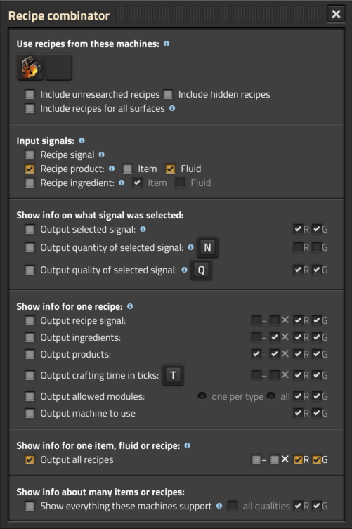

# Recipe combinator

This mod is intended for people who want to make automatic malls, which can craft small amounts of many different items using only a few machines.  It adds a new type of combinator which gives a wealth of information about recipes.  I made it because I didn't like wiring up a separate assembler in the mall just so that I could use "read ingredients".  Recipe combinators can also give more information than "read ingredients", such as supported modules, crafting time, output quantity and so on.

Recipe combinators work more like selector combinators, instead of arithmetic or decider combinators.  They process input as follows:

* The input is a recipe or item or fluid that you want information about (configurable in the combinator settings).
* If there's more than one input that the combinator can give information about, it picks only one.  It can optionally output which signal it chose.
* When choosing an item/fluid, the combinator usually chooses only one recipe that produces/consumes that item/fluid (configurable in settings).  The exception is the "output all recipes for this item/fluid" option, which of course shows them all.
* Once it has chosen a recipe, the combinator outputs the information you choose about that recipe.
* The information that the combinator outputs is configurable: ingredients, products, recipe signal, crafting time, crafting machine, allowed modules, etc.

Features:

* You can select which machines you are controlling.  These have priority, for example to prefer foundries instead of furnaces.
* Output recipe ingredients, products, and crafting time.
* Output which machine should craft the recipe.
* Output which modules are supported by that machine/recipe.
* Output all recipes supported by a certain machine, or all recipes that produce a certain product.
* Outputs can be on red or green wires, and can be optionally negated or multiplied by the input.
* Supports quality.
* Partially supports getting info on spoilage time and products.  To do this, select "spoilage mechanic" from the machines panel.

Known issues:

* When changing combinator settings by pasting a blueprint over them, if the blueprint snaps to a grid, then the affected entities are not always calculated correctly.
* When asking for all recipes that produce a normal fluid output, only normal-quality recipes are shown.  This should probably be the default behavior anyway, but maybe there should be a checkbox to show all qualities.
* The combinator's calculations do not take productivity (whether from the machine, modules or research) into account.
* The combinator's calculations do not take randomized outputs into account.