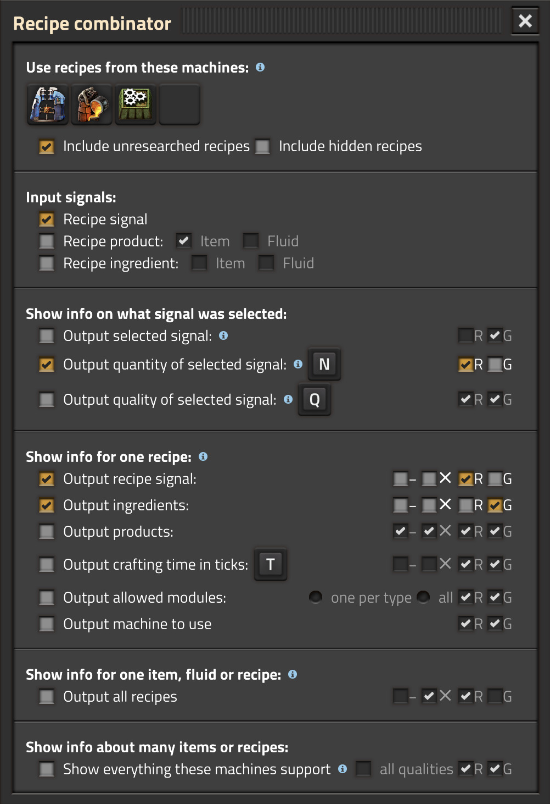

# Recipe combinator

This mod is intended for people who want to make automatic malls.  It adds a new type of combinator which gives a wealth of information about recipes.

Features:

* You can select which machines you are controlling.  These have priority, for example to prefer foundries instead of furnaces.
* Output recipe ingredients, products, and crafting time.
* Output which machine should craft the recipe.
* Output which modules are supported by that machine/recipe.
* OUtput all recipes supported by a certain machine, or all recipes that produce a certain product.
* Outputs can be on red or green wires, and can be optionally negated or multiplied by the input.
* Supports quality.
* Partially supports getting info on spoilage time and products.

Known issues:

* When changing combinator settings by pasting a blueprint over them, if the blueprint snaps to a grid, then the affected entities are not always calculated correctly.
* When asking for all recipes that produce a normal fluid output, only normal-quality recipes are shown.  This should probably be the default behavior anyway, but maybe there should be a checkbox to show all qualities.
* The combinator's calculations do not take productivity (whether from the machine, modules or research) into account.
* The combinator's calculations do not take randomized outputs into account.